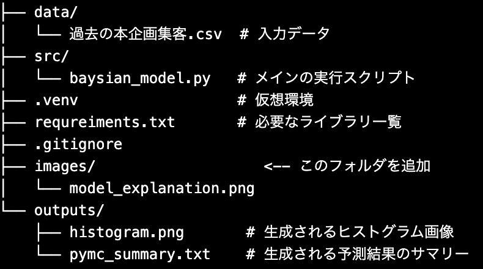
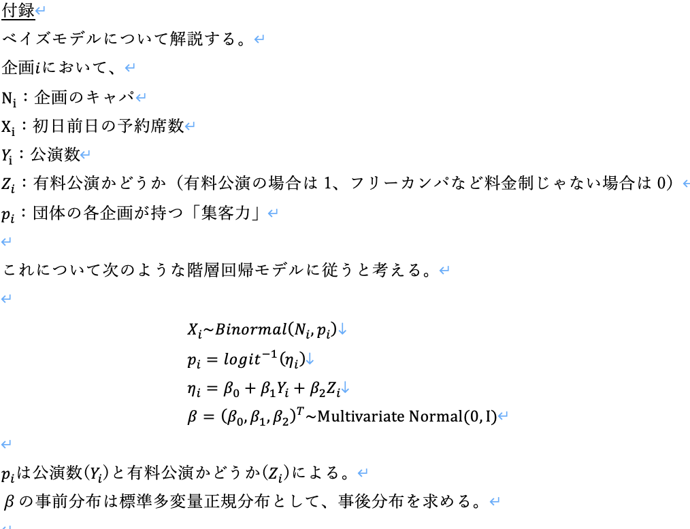

# drama-promotion
=======
# ベイズ統計モデリングによる公演動員数予測

## 概要
 - このプロジェクトは、過去の公演データを用いて、将来の公演における動員数をベイズ統計モデリング（ロジスティック回帰）を用いて予測するものです。
 - PythonのライブラリであるPyMCを使用し、マルコフ連鎖モンテカルロ法（MCMC）によってパラメータの事後分布を推定します。最終的に、特定の条件下（公演数、有料/無料など）での集客率と具体的な動員数を予測し、その結果をテキストファイルに出力します。

## 機能
 - データ前処理: CSVファイルから過去の公演データを読み込み、企画ごとに集計・整形します。
 - ベイズモデル構築: PyMCを用いて、公演数と有料公演かどうかが集客率に与える影響をモデル化します。
 - MCMCサンプリング: MCMCを実行し、モデルのパラメータ（β_0,β_1 ,β_2）の事後分布を推定します。
 - 動員数予測: 新しい公演の条件（公演数、有料/無料）に基づき、集客率の事後分布を計算し、具体的な動員数を予測します。

## 結果の可視化と保存:
 - 入力データのヒストグラムを画像ファイルとして保存します。
 - モデルの要約と最終的な予測結果をテキストファイルとして保存します。

## ファイル構成

## 必要条件
このスクリプトを実行するのに必要なライブラリはrequirements.txtにあります。

## モデルの説明
このプロジェクトで使用しているベイズモデルの構造は、以下の図の通りです。

事後分布ついて、サンプルを生成し、それを元に新しいp_iを予測する。
